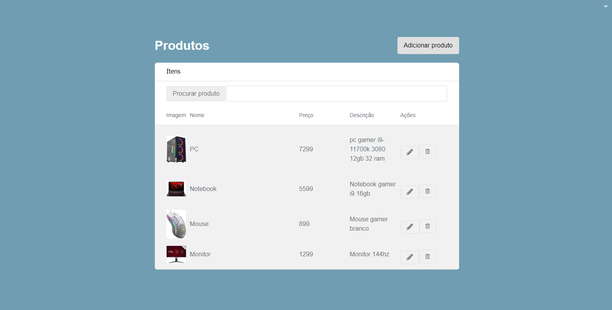
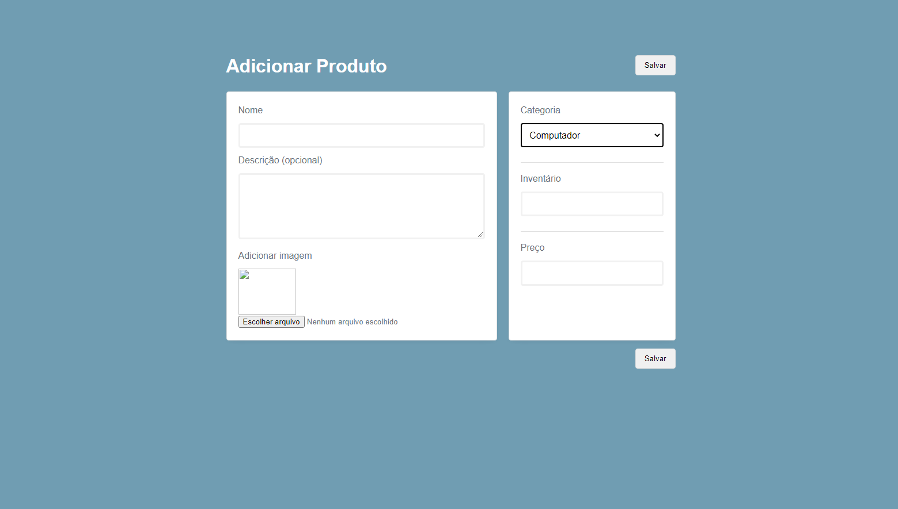

## Instalação

Siga as etapas abaixo para baixar e executar o projeto localmente:

1. Clone este repositório para o seu computador: 

git clone URL_DO_REPOSITORIO

2. Navegue para o diretório do projeto clonado:

cd nome-do-projeto

3. Instale as dependências do Laravel:

composer install

4. Copie o arquivo .env.example e renomeie para .env:

cp .env.example .env

5. Configure o arquivo .env com as informações do seu ambiente, como as credenciais do banco de dados.

6. Gere a chave de criptografia do Laravel:

php artisan key:generate

7. Instale as dependências do Node.js:

npm install

8. Execute as migrações do banco de dados:

php artisan migrate

9. Inicie o servidor de desenvolvimento do Laravel Sail:

./vendor/bin/sail up

10. O projeto estará disponível em http://localhost:8000.

...

<h2>Utilizando a Aplicação</h2>

<h3>Criando um novo produto</h3>

1. Na página inicial, clique no botão "Novo Produto" para abrir o formulário de criação de produto.
2. Preencha os campos obrigatórios, como nome, descrição e preço.
3. Selecione as opções desejadas e adicione as informações adicionais, se necessário.
4. Clique no botão "Salvar" para criar o produto.

<h3>Pesquisando produtos</h3>

1. No campo de pesquisa na barra de navegação, digite o nome ou parte do nome do produto desejado.
2. Os resultados da pesquisa serão atualizados automaticamente conforme você digita.
3. Clique no produto desejado para visualizar os detalhes.

<h3>Atualizando um produto</h3>

1. Na página de detalhes do produto, clique no botão "Editar".
2. Faça as alterações desejadas nos campos correspondentes.
3. Clique no botão "Salvar" para atualizar as informações do produto.

<h3>Configuração do Banco de Dados</h3>

1. Abra o arquivo .env e encontre a seção de configuração do banco de dados.
2. Preencha as informações de conexão com o banco de dados, como o nome do banco, usuário e senha.
3. Salve as alterações no arquivo .env.

Abra o arquivo .env e localize as configurações de autenticação.
Defina as configurações de autenticação, como a chave do aplicativo e as opções de driver.
Execute as migrações do banco de dados para criar as tabelas necessárias para autenticação.

<h3>Contato</h3>

Para contato, ou alguma dúvida segue meu e-mail: bgferreira0@gmail.com

<h3>Desafio vaga Full Stack</h3>

De inicio não tinha conhecimento sobre Laravel nem sobre React, após estudar as linguagens e frameworks, realizei alguns testes e dediquei um bom tempo para aprender essas tecnologias, e ainda vou continuar estudando, como houve muita dificuldade no processo de criação do Frontend acabei utilizando do html, css, javascript básico, e bootstrap fugindo do requsiito "Criar uma aplicação SPA com React.js 18 e typescript", mas o Backend foi possível por meio de buscas na internet até conseguir criar uma api rest
com laravel 10.

